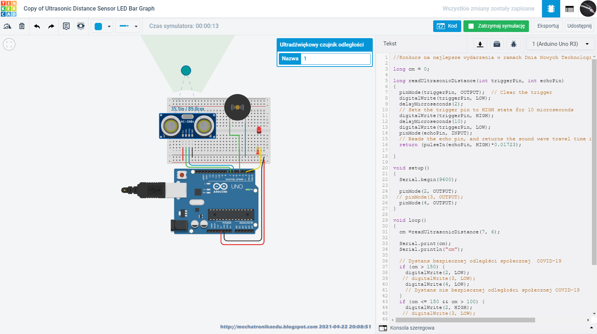

## GitHub ZSTarduino

You can use the [editor on GitHub](https://github.com/projektar22/zstarduino/edit/gh-pages/index.md) to maintain and preview the content for your website in Markdown files.

# Dzień Nowych Technologii
> Projekt kieszonkowego sensora zbliżenia!
# Arduino_ZST
 👋 Cześć, jestem @batqar
 👀 Interesuje mnie mechatronika
 🌱 Obecnie się uczę języka python
 💞️ Chcę współpracować przy projektach Arduino sterowniki domowe
 📫 Jak do mnie dotrzeć: na https://www.facebook.com/zstkolbuszowa

```markdown
Syntax highlighted code block

# Header 1
## Header 2
### Header 3

## General info
Nauka mechatroniki, Arduino, Linux Debian 11

## Screenshots


## Technologies
* dokumentacja_sensora_dystansu- version 1.0
* czujnik_dystansu_spolecznego- version 2.0

## Setup
Describe how to install / setup your local environement / add link to demo version.

## Przyłd kodu
`Przykład kodu wykonującego: 
int Trig = 2; // Numer pinu wyzwolenia int Echo = 3; // Numer pinu odpowiedzi int Red = 4; // Numer pinu - dioda czerwona long EchoTime; // Czas trwania sygnału ECHO int Distance; // Odległość w centymetrach int MaximumRange = 200; // Maksymalna odległość int MinimumRange = 2; // Minimalna odległość void setup()`

## Udoskonalenie w przyszłości
Przbudowa do Arduino mini, wykonaie wersji kieszonkowego sensora zliżeniowego

## Status
Project is: _przetestowany projekt symulacji, _zakończono testy na prototypie_, _z powodu braku wtyczek, projekt się wydłużył.

## Inspiracje
Inteligętne domy Arduino

## Contact
Created by [budownictwa@zoho.com](http://mechatronikaedu.blogspot.com/) - nie wahaj się ze mną skontaktować!
Your Pages site will use the layout and styles from the Jekyll theme you have selected in your [repository settings](https://github.com/projektar22/zstarduino/settings/pages). The name of this theme is saved in the Jekyll `_config.yml` configuration file.

